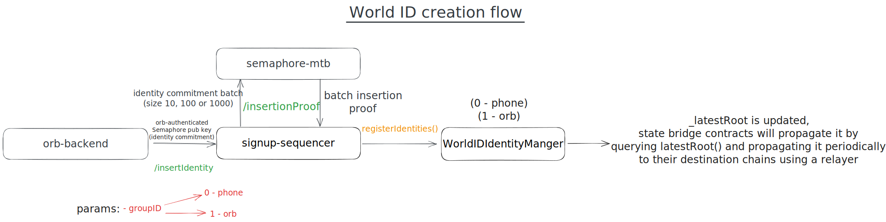

# User flow diagrams

## World ID creation

Once a user visits an orb and does a successful signup, the orb's backend will insert the user's
Semaphore public key (identity commitment) to the
[`signup-sequencer`](https://github.com/worldcoin/signup-sequencer) queue. The signup sequencer will
create a batch of size 10, 100 or 1000 (based on current parameters), create a zk proof of insertion
using [`semaphore-mtb`](https://github.com/worldcoin/semaphore-mtb), calls `registerIdentities()`
and the contract verifies the proof and updates the merkle tree root. Each chain that World ID
supports (currently Base, Optimism and Polygon PoS) has a state bridge contract which fetches the
state from the `WorldIDIdentityManager`contract and propagates it further to the other chains. The
state bridge contracts can be found [here](https://github.com/worldcoin/world-id-state-bridge).

## Verification (proof of personhood)

The below diagram shows the flow of a verification request. The user will generate a proof using
[`semaphore-rs`](https://github.com/worldcoin/semaphore-rs) from within the World App or elsewhere,
and then send it to the World ID contract. Alternatively, app developers integrating WorldID can use
[`IDKit.js`](https://github.com/worldcoin/idkit-js) to handle all the interactions with WorldID on
the client side. The
[`WorldIDRouter`](https://github.com/worldcoin/world-id-contracts/blob/main/src/WorldIDRouterImplV1.sol)
will route the proof to the specified group (0 - Phone, 1 - Orb) and the
[`WorldIDIdentityManager`](https://github.com/worldcoin/world-id-contracts/blob/main/src/WorldIDIdentityManagerImplV1.sol)
contract will verify the proof using the
[`SemaphoreVerifier`](https://github.com/worldcoin/semaphore-v3/blob/main/packages/contracts/contracts/base/SemaphoreVerifier.sol).
If the proof is valid, the call won't revert and therefore any subsequent logic from the app
integrating WorldID will go through. If the proof is invalid, it will revert with
[`InvalidProof`](https://github.com/worldcoin/semaphore-v3/blob/b90a78e2e816cb423aac17ce03b81bfc56be659c/packages/contracts/contracts/base/Pairing.sol#L148).
Note that the inclusion proof needs to be generated against a merkle tree root that already includes
the identity commitment of the user. In the backend, the merkle path for a given node is fetched
from the [`signup-sequencer`](https://github.com/worldcoin/signup-sequencer) using `/inclusionProof`
and the proof is generated against the latest root inside of the World App. Proofs can also be
verified off-chain by the `signup-sequencer` using `/verifySemaphoreProof` or using `semaphore-rs`
if you manually provide all the right parameters.

